# Rock Paper Scissors

## About

Rock, Paper, Scissors is a classic game of chance presented to the user in the form of a browser based game.
[Link to live site](https://cldaly2904.github.io/rock-paper-scissors-game/)

The purpose of the site is to entertain both new and returning users by allowing them to compete against the computer, where the first to win three draws wins the overall game.

For first time users, the site has a welcome page where they may view the rules of the game and there is clear navigation between the site's two pages. As the computer randomly generates their choice, the game remains challenging for returning players. 

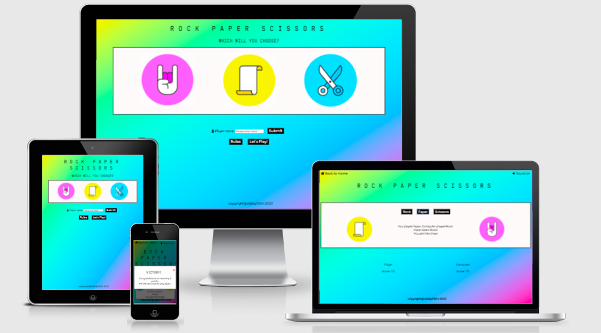

## User Experience

### Target Audiences
- For users wanting to relax and have some fun playing a simple yet engaging browser based game!
- For users that do not know how to play rock, paper, scissors
- For users that may have played rock, paper, scissors but not online
- For users that have played other rock, paper, scissors games

### User Aims
- As a user, I am looking to be able to play a quick game where little set-up is required
- As a user, I am coming to this site to have fun and be entertained
- As a user, I want clear prompts and instructions on how to play the game
- As a user, I want to be able to see the rules of the game
- As a user, I want clear navigation around the site to play the game
- As a user, I want it to be obvious where the controls are and what I should click
- As a user, I want to know if I have won or lost a draw
- As a user, I want to know if I have won or lost the game overall
- As a user, I want to be able to see my score
- As a user, I would like the option to play the game again
- As a user, I would appreciate visual aids/graphics
- As a user, I want to be able to play on any device

### Rock, Paper, Scissors' Aims

- To create a visually appealing space that is fun for all users
- To create a game that can be enjoyed again and again
- To provide clear instructions to players
- To provide a positive user experience
- To provide simple and clear navigation options to users
- For the game to be well presented on any device

### User Stories

- First time visitors
    - There is a clear option on the landing page where they can view the rules of the game if they don't know how to play
    - The game gives feedback with each drawer which reiterates which rock, paper, scissors choice beats which
    - First time users can use the intuitive button at the top of the page to return to the homepage and view the rules again

- Returning visitors
    - As the computer's choice is based upon a random number generator, the computer's choice is truly random. This means that there is no pattern that the player can learn to easily beat the game, helping to ensure they do not tire of it
    - Users who have played the game enough may also get the added benefit of being able to recognise whether the outcome of a draw by the unique sound played for winning, losing and drawing, thus speeding up their gameplay

### User Journey

1. As a user, I find the browser based game through a search engine with key words
2. I land on a colourful page that tells me that it is a Rock, Paper, Scissors game with a tag line that makes me realise the game is based on choices. The images on the page match the title as they are for a hand in a fist showing rock, a picture of paper and a pair of scissors
3. I see that I need to choose my own player name
4. I see that I can check the rules before I play the game. When I click the 'Rules' button, a popup tells me that I need to choose either rock, paper or scissors, that I will be playing against the computer, and how I can beat it. I know now that I need to beat the computer 5 times to win the game overall.
5. I enter my chosen username and when I am ready to play, I hit the button that says 'Let's play'
6. I am greeted by a message that tells me I need to click on one the big black buttons
7. When I make my first choice and click on the button, several things happen at once. I can see the images change and there is sound. There is a message that tells me if I have won or lost.
8. I notice down at the bottom that my score has increased (or computer score has increased)
9. I don't want the sound on, so I click at the top where I recognise the volume icon and it turns off
10. I choose again until I have won or have been beaten by the computer. (If user leaves the sound on, they may know immediately after clicking the button if they have won or not if they recognise the sound effects)
11. A message pops up to tell me I have won (or lost) the game overall, and that if I click the red cross I can play again
12. If I click the red cross I can see both my score and the computer score have gone back to 0

When planning Rock, Paper, Scissors, I had to consider how I was going to achieve both the above aims for the user, and for the game's creators. This led to the creation of all the features found in the Features section.

### Colourscheme

As Rock Paper Scissors is ultimately a game, I wanted to make the site a fun space. For this reason I chose to provide users with a colourful gradient background. I used an eyedropper tool to pick the exact colours from the three main images used (the rock, paper and scissors icons) and used [ColorSpace's gradient generator](https://mycolor.space/gradient3) to create a vibrant background that maintained colour continuity for the user. I went for a 'retro' feel to the site that would be colourful enough to engage younger users, but would also resonate with older users.

I paired this with large white areas for much of the gameplay so as not to distract the user from the game itself and to ensure there was still sufficient contrast for the user.

I also added a fallback background colour that was a transition colour between the pink and blue of the gradient in case the gradient image failed to load in the browser.

### Fonts

I settled on Jet Brains Mono for the headings in Rock Paper Scissors as it is a basic but computer-like font, reminiscent of the retro direction I have taken this browser-based game. Sora was chosen as a complimentary font for the body as it still has a computer-like feel but is slightly softer. Both fonts are very easy to read and greatly accessible to both users. They were chosen from an article by awwwards. on the [20 Best Google Fonts](https://www.awwwards.com/20-best-web-fonts-from-google-web-fonts-and-font-face.html).

### Wireframes

Before building my site in Gitpod, I took all of the features I thought to be in scope and combined these with my design ideas to create wireframes in Balsamiq.

For the most part I was able to stay true to these wireframe plans, however at my mentor's suggestion I added the button to toggle sound on/off in play.html and took out the submit button in index.html (reasoning covered in my TESTING.md file).

- [Index.html wireframe](wireframes/wireframe-index.png)
- [Play.html wireframe](wireframes/wireframe-play.png)

## Features

### Title
- Kept exactly the same across both .html pages for consistency

### Tagline 
- When the player lands on the homepage, they are met with the tagline "What will you decide?" underneath the title
- Serves to intrigue the user, but also lets them know that the gameplay is based on choices

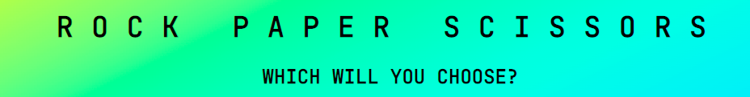

### Home button

- Contained in the header
- Provides the user with a simple way to navigate between the home and play pages
- Use of home icon to make the navigation buttons intuitive for first time users
- Only in play.html so as not to confuse user when they are in index.html
- Contains sound on/off toggle button to keep it clear of gameplay area

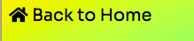

### Player name input

- Allows the user to use a chosen player name
- Gives the game a more personal feel and allows user to further engage with the game
- Set to be required, will only accept alphabet

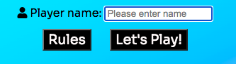

### Rules

- Modal popup box triggered by the click of the 'Rules' button on the homepage
- Allows first time users to read and understand the rules of the game
- Sets the terms of overall victory for users new to the game, but also to those familiar to the game of Rock Paper Scissors

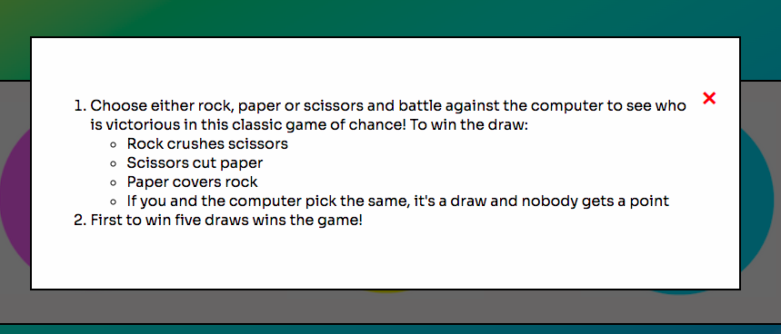

### Buttons

- Following user feedback during the testing phase of creating Rock Paper Scissors, I increased the size of the buttons to make sure they were a clickable size on the site and gave them hover features. This meant that the presence of the buttons were not only more obvious to users as features on the page, but also provided better feeback from the page to the user and improved experience. However, as covered within my TESTING.md file, I ended up disabling the hover effects for users with touch devices as their rock, paper, scissors choice button remained in their hover state until the next one was chosen, resulting in confusing user feedback
- The 'Let's play!' button serves as call-to-action button for the user

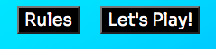
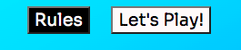

### Player choice buttons

- The player choice buttons are the only three buttons in the gameplay area so as not to confuse or distract the user
- Clearly labelled
- User is directed to select one of the buttons by a greeting in the result area telling them to "choose from one of the buttons above to get started" which helps to define their role within the game

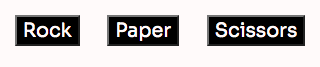

### Area to display player and computer choice icons

- Each time the user makes their choice, both the images contained in the player choice and computer choice display divs are updated to reflect the choices made
- This is a great visual aid for the user as allows them to see quickly what the computer has played without having to read the message in the result message area
- Keeps consistent use of the rock, paper, scissors icons accross the site
- Adds a greater sense of interactivity for the user rather than just being a fairly static browser based game

### Result message area

- Gives the user feedback on their input and the play generated by the computer
- Breaks down the outcome of the draw for the user, which is great for users with screenreaders that would find it more difficult to rely on the updated images (although alt attributes do also update)

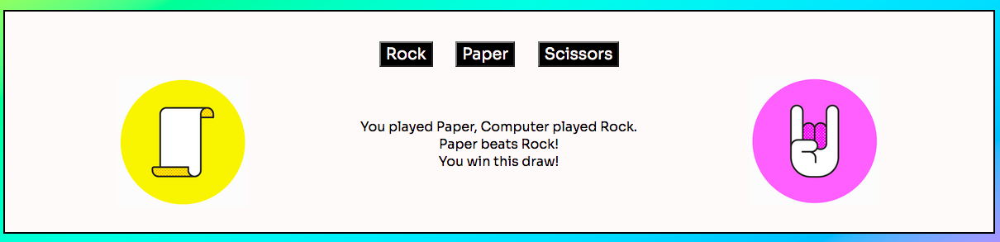

### Sound effects

- Three different sound effects used for win, draw and lose to differentiate outcomes for users
- Can be controlled at the top of the page with a toggle that is clearly marked by a volume icon
- Also benefits users with vision impairments

### Scoreboard

- Uses stored variable of player name to invest the user
- Displays running total of draws won by the user and computer so user can see how close they are to a victory or a loss
- Resets after each match
- I had originally planned for the game to be a first to 3 competition. However during the testing phase, I felt that this was a little short and that the user may get frustrated by constantly having to restart the game so upped the match victory requirements to the first to win 5 draws

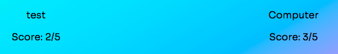

### Victory and defeat popup modals

- Upon the user being the first to reach 5 points, a 'Victory' message will be displayed in the form of a modal popup to congratulate them
- Upon the computer being the first to reach 5 points, a 'Defeat' message will be displayed
- Both messages let the user know that to play again they must click the red cross for the game to reset
- As with the rules popup modal, the user may also simply click outside of the modal for it to disappear and the game to reset

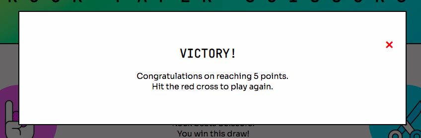

## Possible Future Features

### Countdown timer

- Display a countdown timer from 3. Triggered when user has chosen their input play, countdown to show computer play and draw outcome. Adds tension and excitement for user

## Technologies Used
- Eyedropper Tool (Chrome Extension)
    - This tool allows me pick any colour from the web page I am and gives me the name (if applicable), hex, hsl and rgb values. I used this to choose the background colour for the webpages and the divs to ensure they matched the colours from the rock, paper and scissors icons used
- WebAIM
    - Contrast Checker - checks the contrast of colours input against the Web Content Accessibility Guidelines. I input my background and foreground/text colours to ensure they meet the WCAG AA/AAA standards
    - WAVE - WAVE can identify many accessibility and Web Content Accessibility Guideline (WCAG) errors
- Balsamiq wireframing tool -
    - To create wireframes and plan out my project before beginning to write it in Gitpod
- Canva -
    - I used the online image cropping tool to cut the rock, paper, scissors image I found on Vecteezy into three individual icons
- Fontawesome
    - The home and volume icons are taken from FontAwesome version 5
- Google Fonts
    - Both my title and body fonts are imported from Google Fonts
- W3C Markup Validation Service
    - I used the HTML validator to run both my html pages and ensure there were no errors
    - I used the Jigsaw CSS validator to ensure that my CSS file did not contain any errors
- Lighthouse (Chrome DevTools)
    - An open-source, automated tool for improving the quality of web pages. I used it to audit performance, accessibility, SEO and best practices
- JS Hint
    - An online service used to validate my javascript files
- Github to deploy and host my live site
- Gitpod to an open-source developer platform used to write my code (using VS Code)
- Visual Code Studio (VS Code)
    - Visual Studio Code is a streamlined code editor with support for development operations like debugging, task running, and version control
    - I used several VS Code extensions to help make my work more efficient such as:
        - Auto Close Tag (automatically adds HTML/XML closing tags)
        - Auto Open Preview Page (opens a preview panel when markdown or asciidoc file is opened)

## Testing 

Testing notes for this project are contained in a separate [TESTING.md](TESTING.md) file.

## Deployment

The site was deployed and hosted using GitHub's Pages feature. The steps to deploy are as follows:
1. In the GitHub repository, navigate to the Settings tab
2. Find and select Pages from the menu on the left
3. From the source section drop-down menu, select the Main Branch
4. Once the Main branch has been selected, click save.
5. The page should refresh automatically with a ribbon display to indicate the successful deployment. However, it may take a moment for the site to deploy.

To clone the project (taken from [GitHub Docs](https://docs.github.com/en/repositories/creating-and-managing-repositories/cloning-a-repository)):
1. On GitHub.com, navigate to the main page of the repository.
2. Above the list of files, click the green 'Code' button.
3. To clone the repository using HTTPS, under "Clone with HTTPS", click the clipboard icon. To clone the repository using an SSH key, including a certificate issued by your organization's SSH certificate authority, click Use SSH, then click the clipboard icon. To clone a repository using GitHub CLI, click Use GitHub CLI, then click the clipboard icon.
4. Open Terminal.
5. Change the current working directory to the location where you want the cloned directory.
6. Type git clone, and then paste the URL you copied earlier.
7. Press Enter to create your local clone.

The live link can be found here - 
- [Link to live site](https://cldaly2904.github.io/rock-paper-scissors-game/)
- [Link to repository](https://github.com/ClDaly2904/rock-paper-scissors-game)

## Credits

### Content

- I used a video tutorial from [freeCodeCamp](https://www.youtube.com/watch?v=jaVNP3nIAv0) to help form some of the functions used for gameplay
- I took some inspiration from the Code Institute's [LoveMaths](https://codeinstitute.net/) Project, for example the code used to upadate the player and computer scores
- Whilst debugging my code to use local storage, I found this article and video from [How to Code School](https://www.howtocodeschool.com/2019/05/passing-javascript-value-from-one-page.html) very useful
- This article by [Better Programming](https://betterprogramming.pub/how-to-restart-a-css-animation-with-javascript-and-what-is-the-dom-reflow-a86e8b6df00f) on how to restart a css animation was vital to allowing me to animate each rock, paper, scissors draw
- Code to disable hover effect on touch devices from the blog [Web Dev Puneet](https://webdevpuneet.com/how-to-remove-hover-on-touch-devices/#gsc.tab=0)

### General Reference

- [W3Schools](https://www.w3schools.com/html/). I relied heavily on the guide for making modal popup boxes from this site
- [CSS Tricks](https://css-tricks.com/snippets/css/a-guide-to-flexbox/)
- [Stack Overflow](https://stackoverflow.com/), in particular the code used to mute and unmute all elements on the page in [this article](https://stackoverflow.com/questions/14044761/how-to-mute-all-sound-in-a-page-with-js)
- [Mdm Web Docs](https://developer.mozilla.org/en-US/)

### Media

- Rock Paper Scissors icons from [Vecteezy](https://www.vecteezy.com/free-vector/rock)
- Fonts from [Google Fonts](https://fonts.google.com/)
- Icons used from [FontAwesome](https://fontawesome.com/v5/search)
- Background gradient generated using [ColorSpace](https://mycolor.space/?hex=%23C02141&sub=1)
- Sound effects taken from [Mixkit](https://mixkit.co/free-sound-effects/)