# Testing

Whilst testing my game, I mainly used a combination of a live server extension (port 800 on Gitpod), and Chrome DevTools.
I used DevTools to create a responsive site that maintains solid design structure down to a width of 320px, with the last media query necessary at 413px.

To test responsiveness, I also opened the site on the different screen sizes of my iPhone and iPad. This gave me the opportunity to see if the proportions felt natural on these screen sizes and also to test the compatability with Safari, as most of the development was with Chrome.

Further to this, once the game was deployed, I sent the link to the live site to potential users with different devices (such as Android) and browsers for testing. There were no reported issues regarding layout or browse limitations, but there was helpful feedback regarding design pertaining to the use of hover effects on touch devices (see the Fixed Bugs section below).

Having learnt from my previous project, I took a 'mobile first' approach when designing Rock, Paper, Scissors as a browser based game, with a simple layout and ample horizontal space to accomodate smaller screen sizes without much need for reconfiguration.

## Fixed bugs

Whilst testing the live site at different stages of building Rock, Paper, Scissors and testing on different devices, I encountered some unexpected results and bugs. Many of these occured in my Javascript files. To solve these, I largely experimented with changing code and spent a lot of time researching on sites such as [W3Schools](https://www.w3schools.com/html/), [Stack Overflow](https://stackoverflow.com/) and browsing resources on [Google](https://www.google.com/).

I found in order to find the right help and information, I had to really think about what I was trying to do and how best to describe my issue. Upon finding the relevant information, I took some time to understand the solution and how I could implement that into my project.

### Broken image links
- When I first deployed my project and pushed the data to gitHub, I was surprised to see that my images hadn't loaded. As the alt text was visible, I concluded that the error must lie within the file path I had used. After reviewing the filepaths content on W3C I as quickly able to see that the '/' I had used at the start of the filepath needed removing in order to make the filepath relative, thus solving the issue when deployed.

### Hover effect
- I implemented a hover effect across the buttons in my game to give user feedback and to increase interactivity within the site. I found that this worked great on the computer that I built the project on, however when I sent the live site out for users to test, it was fed back that the buttons were 'stuck' after being pressed.
This was particularly noticeable with the 'rock', 'paper' and 'scissors' in play.html which stayed in their white hover effect state after being pressed and until the next choice was selected. This led to some confusion amongst users.
- After a bit of research I found a solution in a tech blog which disables the hover effect for devices that does not support it or have a touch functionality, whilst continuing the enable it for others.
- There is a limitation to this fix as it also removes the hover effect for devices that have both touch and mouse/cursor functionality. However, I weighed up the smaller benefits for the fewer users affected by this limitation compared to the larger number of users affected more adversely by the effects if I had not implemented this change.

### Submit button
- One element I ended up completely removing from my game was the 'Submit' button on the index.html page. In the end I removed this feature for two reasons:
1. It was an extra and unneccesary button click for the user so impacted upon user experience. Its purpose for the game was to store the player username variable upon being clicked, but did not actually provide any feedback to the user so could be considered confusing.
2. It caused a potential bug if the user wanted to return to the homepage and update their username. As the player username variable had already been previously stored, they would not be required to hit the 'submit' button again so on their journey would naturally just hit the 'Let's play' button after entering their new chosen username. Without the submit button being clicked, the user would find themselves on play.html but with their old username still, adding to poor experience.
- Prior to removal, this button also other bugs. Although the fixes were subsequently irrelevant once the submit button had been removed and thus also removed, they still proved as valid teaching points for me. When the user clicked on the submit button to add in their player name, it automatically redirected them to play.html. This could cause confusion for users and frustration for those that then had to return to the homepage to read the rules of the game.
- One error was that I did not realised that any button within a form can trigger a submit action on that form. To solve this, I added an event.preventDefault function within my handleSubmitUsername function which already had its own event listener, so I just passed the 'event' as the argument. This stopped the automatic redirection.
- I had also however, accidentally used code from the function to store my variable that directly told the browser to redirect the user to the play.html page. Within my handleSubmitUsername function, I had added window.location.href for play.html. I had originally understood this to be redirecting the stored object to that page, but after some help from tutor support realised this was actually redirecting the user themselves so needed removing.

## W3C Validator

To ensure my .html files were compliant with HTML standards, I passed them through the [W3C Validator](https://validator.w3.org/). Originally I had a few issues flag:
- In index.html I had one unclosed ol tag
- Within the form element on the index.html page, the label 'for' the username input did not match the id on the input box
- In play.html, I had made an error with two of my br tags. I had input /bt in error

All of these were easily rectified and upon running 

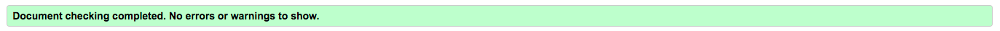

## Jigsaw CSS Validator

No issues were found within the CSS code and it passes through the W3C Jigsaw CSS validator with 0 errors. There is 1 warning which just relates to to the validator not being able to check the external Google Font file that was imported.

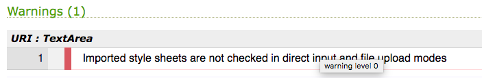
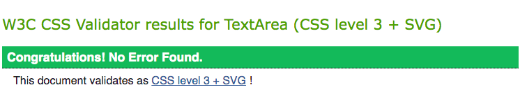

## Lighthouse

I ran both pages through the Lighthouse validator within Chrome DevTools. I employed learnings from my previous project such as ensuring that all of my links and buttons were a clickable size and used smaller image files that still held a good resolution to achieve high scores in both pages. Consequently, no issues were thrown up by the Lighthouse validator.

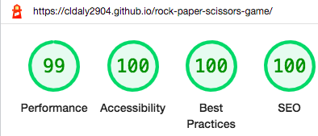
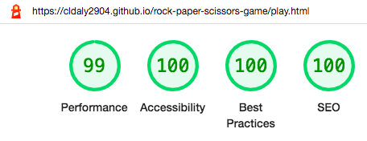

## WAVE

In addition to HTML, CSS and Lighthouse validators, I used the [WebAIM](https://wave.webaim.org/) web accessibility evaluation tool to test the accessibility of my website with no errors or contrast errors showing.

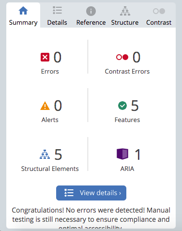
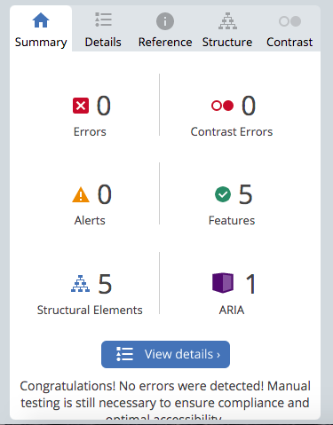

## JS Hint

To check for errors within my Javascript files, I ran them through [JS Hint](https://jshint.com/). For my script files, there were a few missing semicolons after functions, but after these were added they both successfull passes through the validator with no errors or warnings.

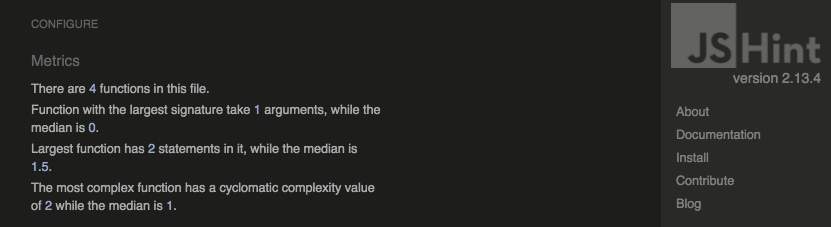
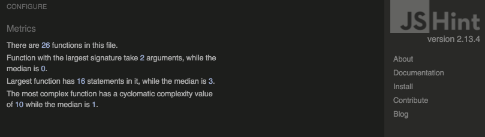

## Colour Contrast Validator

To ensure that all of my colours had the correct level of contrast, I ran them through the [WebAIM contrast checker](https://webaim.org/resources/contrastchecker/). As my background was a gradient, I chose the colours where there was black text on top to run through the checker. For the main gameplay areas, I had used a white div with black writing to ensure high contrast and so as not to distract the user from the game itself.

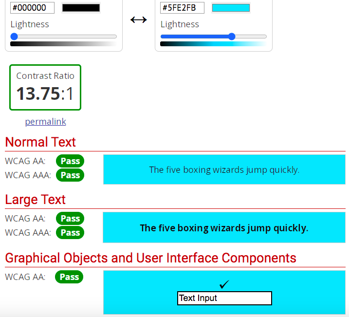
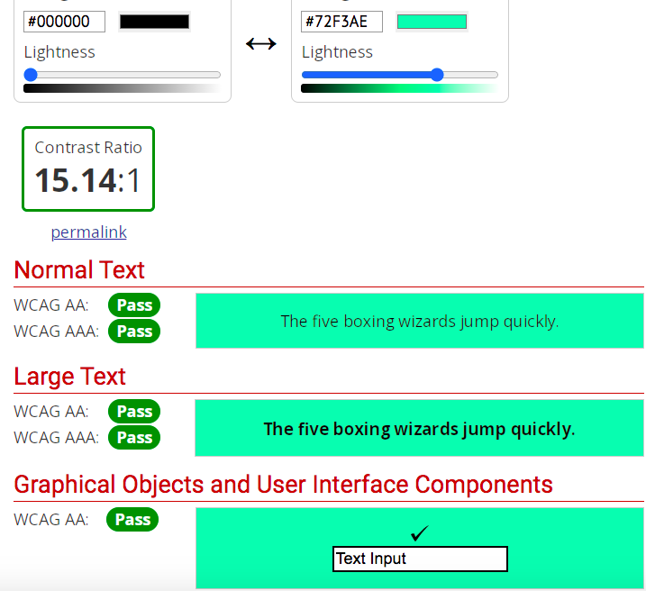
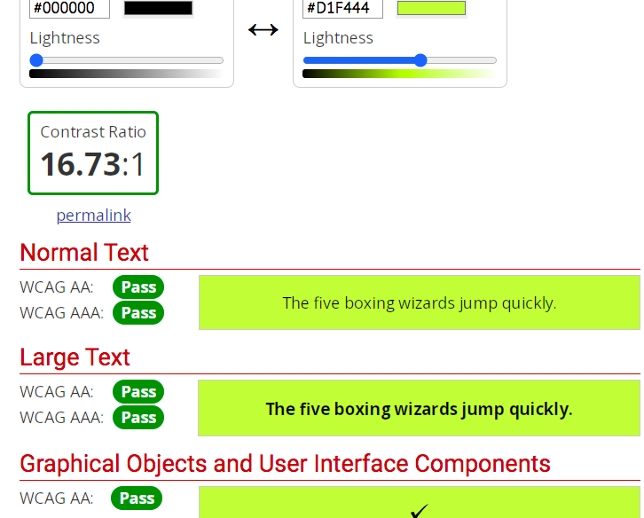
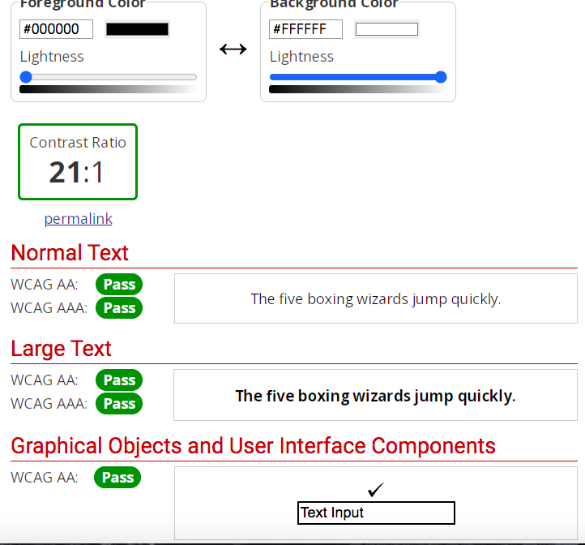